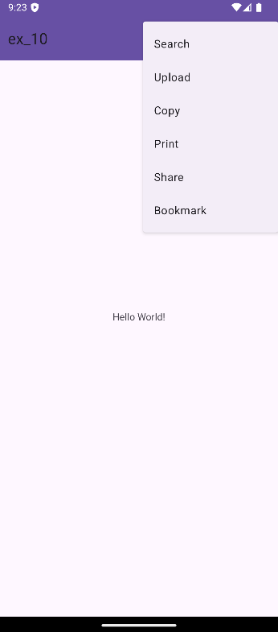

# Ex.No:10 Develop an android application to create a option menu to display menu items using android studio.
## AIM:
To create a option menu to display menu items using Android Studio.

## EQUIPMENTS REQUIRED:
Latest Version Android Studio

## ALGORITHM:
Step 1: Open Android Studio and then click on File -> New -> New project.

Step 2: Then type the Application name as HelloWorld and click Next.

Step 3: Then select the Minimum SDK as shown below and click Next.

Step 4: Then select the Empty Activity and click Next. Finally click Finish.

Step 5: Design layout in activity_main.xml.

Step 6: Display message give in MainActivity file.

Step 7: Save and run the application.

## PROGRAM:

Activity_main.xml
```
<?xml version="1.0" encoding="utf-8"?>
<androidx.constraintlayout.widget.ConstraintLayout xmlns:android="http://schemas.android.com/apk/res/android"
    xmlns:app="http://schemas.android.com/apk/res-auto"
    xmlns:tools="http://schemas.android.com/tools"
    android:layout_width="match_parent"
    android:layout_height="match_parent"
    tools:context=".MainActivity"
    android:background="#272525">

    <TextView
        android:layout_width="wrap_content"
        android:layout_height="wrap_content"
        android:text="Hello World!"
        android:textColor="#FF0000"
        app:layout_constraintBottom_toBottomOf="parent"
        app:layout_constraintEnd_toEndOf="parent"
        app:layout_constraintStart_toStartOf="parent"
        app:layout_constraintTop_toTopOf="parent" />

</androidx.constraintlayout.widget.ConstraintLayout>
```

MainActivity.java
```
package com.example.ex10;

import com.example.ex10.R;
import android.os.Bundle;
import android.view.Menu;
import android.view.MenuItem;
import android.widget.Toast;

import androidx.appcompat.app.AppCompatActivity;
public class MainActivity extends AppCompatActivity {

    @Override
    protected void onCreate(Bundle savedInstanceState) {
        super.onCreate(savedInstanceState);
        setContentView(R.layout.activity_main);
    }
    public boolean onCreateOptionsMenu(Menu menu) {
        getMenuInflater()
                .inflate(R.menu.options_menu, menu);
        return true;
    }
    public boolean onOptionsItemSelected(MenuItem item){
        Toast.makeText(this, "Selected Item: " + item.getTitle(), Toast.LENGTH_SHORT)
                .show();
        switch (item.getItemId()) {
            case R.id.search_item:
                return true;
            case R.id.upload_item:
                return true;
            case R.id.copy_item:
                return true;
            case R.id.print_item:
                return true;
            case R.id.share_item:
                return true;
            case R.id.bookmark_item:
                return true;
            default:
                return super.onOptionsItemSelected(item);
        }
    }

}
```
options_menu.xml
```
<?xml version="1.0" encoding="utf-8"?>
<menu xmlns:android="http://schemas.android.com/apk/res/android" >
    <item android:id="@+id/search_item"
        android:title="Search" />
    <item android:id="@+id/upload_item"
        android:title="Upload" />
    <item android:id="@+id/copy_item"
        android:title="Copy" />
    <item android:id="@+id/print_item"
        android:title="Print" />
    <item android:id="@+id/share_item"
        android:title="Share" />
    <item android:id="@+id/bookmark_item"
        android:title="BookMark" />
</menu>
```
## OUTPUT



## RESULT

The application successfully displays an options menu with various items, and upon selecting any item, a toast message shows the selected item.
